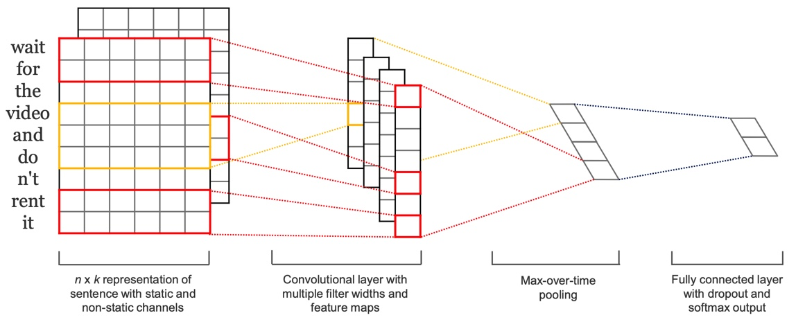
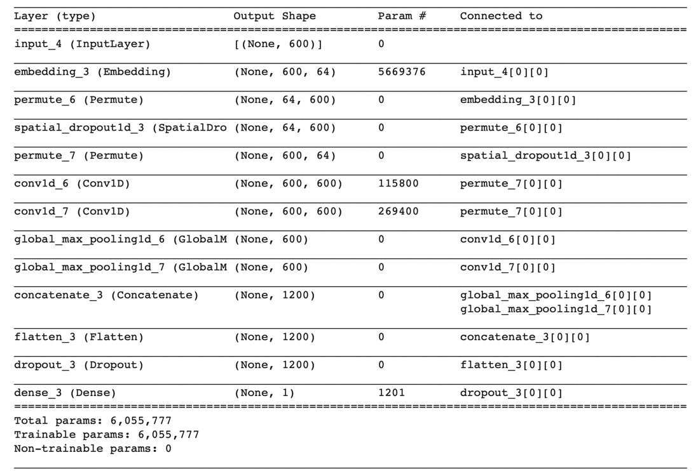
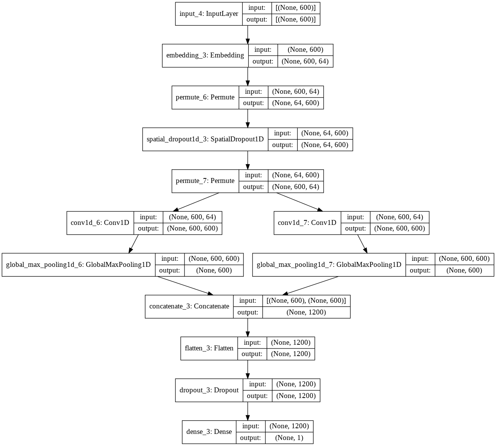
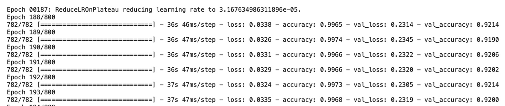

# **IMDb Movie Reviews (Sentiment Analysis)** 

In this project I use a particular type of data augmentation/transformation technique to achieve a state-of-the-art result/accuracy (92.14%) on IMDb sentiment analysis (as compared to pre-BERT/transformers models; in particular, wthout using extra training data or pre-training). 

## IMDb Sentiment Analysis

Sentiment analysis is the task of classifying the polarity of a given text.

The IMDb dataset is a binary sentiment analysis dataset consisting of 50,000 reviews from the Internet Movie Database (IMDb) labeled as positive/negative. The dataset contains an even number of positive and negative reviews (50% train/test split), with only highly polarizing reviews considered (a negative review has a score ≤ 4 out of 10, and a positive review has a score ≥ 7 out of 10. No more than 30 reviews are included per movie). Models are evaluated based on accuracy.

See [PapersWithCode](https://paperswithcode.com/sota/sentiment-analysis-on-imdb) website for the latest leaderboard for this NLP benchmark (e.g. DistilBERT achieves 92.82% accuracy). In particular, prior to introduction of transfer learning for NLP (by [Jeremy Howard and Sebastian Ruder](https://arxiv.org/abs/1801.06146) in 2018), the SOTA results on this task hovered around 92% accuracy. I explore a straighforward model architecture based on Convolutional Neural Network (CNN) approach, together with a number of standard regularization techniques and two data augmentation methods (synonym replacement and random word masking).  

### Embedding Layer
To begin with, variable paragraph lengths are normalized with padding/truncating the vector of words so that all paragraphs are of a fixed length *n*. Given a vocabulary size *V* (i.e. a total number of 'words'/tokens}, and paragraphs/reviews of length *n*, an input to the model is then a vector of integers of length *n* or, alternatively, a *V* x *n* matrix where each one of *n* words in a paragraph is represented by a one-hot encoding vector of length *V*. This approach however leads to large sparse vectors that are not only difficult to perform calculations over, but also not interpretable in terms of context/semantic word properties. To reduce the dimensionality (Tensorflow/Keras provides tokenized reviews with the vocabulary size of *V=88,584*}, dense word representations are learned by the network, where semantically close words are likewise close in Euclidean or cosine distance in now a much lower *k*-dimensional vector space (*k* << *V*). While open source, pre-trained word embeddings such as [Word2Vec](https://en.wikipedia.org/wiki/Word2vec) or [GloVe](https://en.wikipedia.org/wiki/GloVe_(machine_learning)) are readily available, the proposed approach uses an embedding layer that represents the first layer in the neural network and, as such, is learned jointly with other parameters of the classification model. 
As a result, given a length *n* input vector of integers representing words in a given paragraph, and having fixed a chosen embedding dimension *k*, the embedding layer learns *V* x *k* parameters and outputs *n*-by-*k* matrix that represents a paragraph/review, where each row is now a dense word representation. 

### Convolutional Layers

Originally invented for computer vision, CNN models have subsequently been shown to be effective for Natural Language Processing (NLP) and have achieved excellent results on a number of traditional NLP tasks. The approach we use is based on ['CNNs for Sentence Classificaiton' by Y. Kim](https://arxiv.org/pdf/1408.5882.pdf), where a concept of a multi-channel CNN layer is introduced. 

Similarly to its original 2D version, a 1D-convolution operation is defined by a *filter*, which is a matrix *w* of size *h*-by-*k*, that is successively applied to a window of *h* words to produce a new feature. 

As is again common in computer vision, a *pooling* operation is applied to regularize the model, which in this case amounts to returning the maximum of a feature vector as output by a filter *w*. The rationale behind this is to capture the most important feature as the one with the highest value for
this feature map. This process, by which one feature is extracted from one filter, is generalized to multiple filters to obtain multiple features (one per each filter.
Finally, the idea can be further extended to multiple CNN blocks with filters of varying window sizes (one block/channel for each window size), as is visually represented below 

### Regularization 

When using learned embeddings, the embeding layer weights comprise by far the biggest part (>90%) of the trainable parameters set. This makes the embedding layer the first candidate to apply a weight regularization method to. Given a large number of parameters, an L2 regularization is an appropriate choice (as opposed to L1, as we are not looking for a 'sparse' regularization). Note, that L2 regularization is not equivalent to a weight decay here as we use Adam optimizer ([see this post on **fast.ai**](https://www.fast.ai/2018/07/02/adam-weight-decay/)). 

We also use early stopping techniques, as well as a standard dropout method applied to the penultimate network layer. 

### Data Augmentation 
Data augmentation for NLP is a notoriously difficult subject, as compared to, for example, Computer Vision (CV), as there are no obvious transformations to which the outcome (e.g. text classification) is invariant to (as opposed to CV where random image rotations/crops/zooms do not change the 'content'/class of an image). I try two data augmentation methods:

1. **Random Synonym Replacement**: The idea is to augment the data by randomly replacing words with synonyms with the objective to constructing a semantically equivalent text, and hence the same review polarity (positive/negative). We use [NLTK's](https://www.nltk.org) [Wordnet Synsets](https://www.nltk.org/howto/wordnet.html) for this purpose. 
2. **Random Word Masking**: Here the idea is to randomly mask words, i.e. to replace a random word with a 'PAD'/0 token, with the hope that the remaining text is still indicative of the review's polarity. *In other words, the model is forced to learn to pay more attention to parts of the text that contain information related to the polarity of a review.*
Given that reviews/paragraphs are on average comprised of ~300 'words'/tokens, applying a mask with a relatively low probability, e.g. 20%, that is discarding on average 20% of the text, would still contain enough information/text for the model to correctly deduce a review's sentiment.    

### Model Architecture, Hyperparameters, and Results

At a high level, the neural network architecture is that of an Embedding layer + 2-channel CNN + global 1D pooling + final classification layer. 

See Tensorflow's model summary as well as the model plot below 

Note, that random word masking is performed by first transposing the output (*n*-by-*k* matrix) of an embedding layer, then applying a masking by using a [*SpacialDropout1D()*](https://keras.io/api/layers/regularization_layers/spatial_dropout1d/) layer to drop columns of the resulting *k*-by-*n* matrix (i.e. dropping words), followed by another transpose to return back to the original *n*-by-*k* shape.  

Additionally, I have implemented an extended version of the word masking that uses a standard python generator method (that is typically used when performing data augmentation) that drops not just single 'words'/token but also n-grams (e.g. 2-grams). The latter didn't perform much better than a single word dropout, not to mention that it is much slower than the implementation that uses *Spacial1DDropout()* layer. 

The optimal values for key hyperparameters are 

* embedding layer L2 regularizaiton constant set to **2e-3**, i.e. *embeddings_regularizer=regularizers.l2(*2e-3*)*
* word masking probability set to **0.25**.

As for results, using neither L2 regularization or word masking gives 89.66% accuracy as a benchmark. Using L2 regularization with no word masking results in *90.52%* accuracy. Using both L2 embedding layer regularization and random word masking we achieve **~92.14%** test set accuracy.

Random synonym replacement did not seem to improve the model performance; only L2 regularizaiton and random word masking was used in the final model specification.

